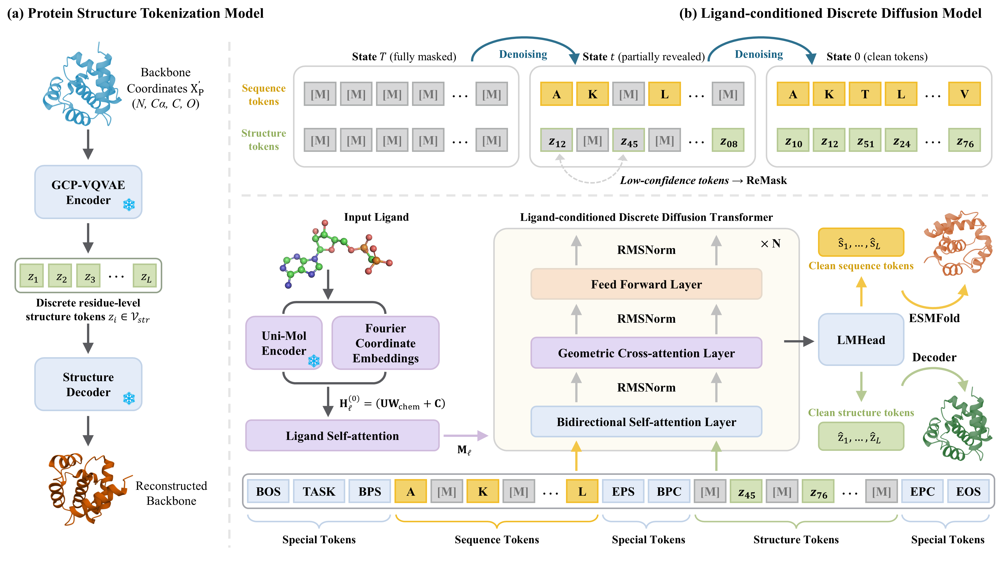

# ProtLiD²: Ligand-Conditioned Discrete Diffusion for Protein Sequence–Structure Co-Design    
    
ProtLiD² is a ligand-conditioned masked discrete diffusion model for protein sequence–structure co-design. It jointly generates amino-acid sequences and protein structures under explicit small-molecule ligand conditioning.    
    
Unlike continuous diffusion or flow-based protein design models that operate in coordinate or latent feature spaces, ProtLiD² performs ligand-aware protein generation in a discrete diffusion framework. Ligand chemical and geometric information is incorporated through geometry-aware cross-attention, enabling the model to design proteins conditioned on small-molecule constraints.    
    
> **Note:** This repository is under active development. Inference and evaluation code, pretrained checkpoints, datasets, and reproduction instructions will be released after refactoring. We plan to make these resources publicly available in July or August.  
    
---    
 ## Overview  
  
ProtLiD² is designed for ligand-aware functional protein generation. Given a ligand and a design condition, the model can generate protein sequences together with corresponding protein structures.  
  
  
  
The model supports the following design settings:  
  
- Ligand-conditioned whole-protein sequence–structure co-design  
- Ligand-binding pocket co-design  
- Masked protein generation with ligand conditioning  
- Inference-time refinement using confidence-margin guided ReMask decoding  
    
---    
 ## Key Features    
 - **Ligand-conditioned discrete diffusion**      
 ProtLiD² extends masked discrete diffusion protein modeling to ligand-aware protein sequence–structure co-design.    
    
- **Joint sequence–structure generation**      
 ProtLiD² generates protein sequences and structures in a unified design framework.  
    
- **Geometry-aware ligand cross-attention**      
 Ligand chemical features and 3D geometric information are injected into the protein denoising Transformer through ligand cross-attention with geometric bias.    
    
- **MCM-ReMask decoding**      
 Maximum Confidence-Margin guided ReMask decoding retains high-confidence predictions and remasks uncertain positions for later refinement, improving sampling stability and sequence–structure consistency.    
    
- **Large-scale ligand–protein training data**      
 The model is trained on more than one million ligand–protein complexes after filtering and leakage removal.    
  
    
---    
 ## Model Architecture    
 ProtLiD² uses a Transformer-based denoising backbone with approximately 370M parameters.    
    
Main architecture settings:  
  
| Component | Setting                                             |  
|---|-----------------------------------------------------|  
| Transformer layers | 16                                                  |  
| Hidden size | 1280                                                |  
| FFN size | 5120                                                |  
| Attention heads | 10                                                  |  
| Protein representation | Joint sequence–structure representation             |  
| Structure tokenizer | Frozen GCP-VQVAE                                    |  
| Ligand encoder | Frozen Uni-Mol |  
| Conditioning module | Geometry-aware ligand cross-attention               |  
| Decoding strategy | MCM-ReMask                                          |  
  ---    
 ## Dataset    
 ProtLiD² was trained on a large-scale ligand–protein complex dataset integrated from multiple sources:    
    
- Protenix training dataset  
- PLINDER    
- CrossDock    
- HiQBind    
- AlphaFill-derived complexes    
    
After source-specific filtering, the merged dataset contained **1,125,038** ligand–protein complexes. To reduce benchmark leakage, training proteins with sequence identity ≥30% to PLINDER test proteins were removed using MMseqs2, resulting in a final training set of **1,026,766** ligand–protein complexes.    
    
Main filtering criteria include:    
    
- Protein length ≤ 1000 residues    
- Ligand size ≤ 100 atoms    
- Valid protein coordinates    
- Valid ligand SMILES    
- At least one ligand-contacting residue within 6.0 Å    
- Removal of severe protein–ligand steric clashes    
- Leakage removal against PLINDER benchmark proteins    
    
---    
 ## Experimental Results    
 ProtLiD² was evaluated on three settings:    
    
1. Ligand-conditioned whole-protein co-design    
2. Ligand-binding pocket co-design    
    
### Ligand-Conditioned Whole-Protein Co-Design    
 Compared with Complexa, ProtLiD² improves global fold consistency:    
    
| Method | BB-RMSD ↓ | CA-RMSD ↓ | TM-score ↑ | pLDDT ↑ | AF3-Vina ↓ |  
|---|---:|---:|---:|---:|---:|  
| Complexa | 10.35 | 10.40 | 0.672 | 64.55 | -7.11 |  
| ProtLiD² | 12.07 | 12.13 | 0.802 | 73.00 | -6.82 |  
  Although Complexa obtains lower RMSD and slightly better average AF3-Vina score, ProtLiD² achieves substantially higher TM-score and pLDDT, suggesting stronger global fold consistency and sequence foldability.    
    
### Ligand-Binding Pocket Co-Design    
 ProtLiD² shows strong performance in local active-site reconstruction:    
  
| Method | Active-site BB-RMSD ↓ | Active-site CA-RMSD ↓ | TM-score ↑ | pLDDT ↑ | Vina ↓ |  
|---|---:|---:|---:|---:|---:|  
| FAIR | 3.46 | 3.37 | 0.866 | 79.83 | -6.94 |  
| PocketGen | 3.40 | 3.50 | 0.869 | 80.83 | -8.84 |  
| ProtLiD² | 1.97 | 2.06 | 0.915 | 79.17 | -6.93 |  
  ProtLiD² substantially reduces active-site RMSD and improves combined ligand-aware pass rates over FAIR and PocketGen, indicating better pocket geometry while maintaining global structural consistency.    
    
---   
  ## Limitations    
 ProtLiD² is currently evaluated mainly with computational metrics and proxy models, including ESMFold, AlphaFold3, and AutoDock Vina. Generated proteins should not be considered experimentally validated.    
    
Current limitations include:    
    
- Reliance on a frozen backbone structure tokenizer    
- No explicit full-atom side-chain generation    
- Limited ligand flexibility modeling    
- Dependence on computational docking and structure prediction proxies    
- Need for experimental validation before real-world biological use    
    
---    
 ## Responsible Use    
 ProtLiD² is intended for research in ligand-aware protein design, enzyme design, and computational biology. Because generative protein design may carry dual-use risks, users should apply appropriate safeguards, including:    
    
- Expert review of generated designs    
- Biosafety screening    
- Experimental validation    
- Compliance with institutional and legal regulations    
- Avoidance of harmful biomolecule design    
   
---    
 ## Citation  
  
If you use ProtLiD² in your research, please cite:  
  
```bibtex  
@article{wei2026protlid2,  
 title   = {Ligand-Conditioned Discrete Diffusion for Protein Sequence--Structure Co-Design}, author  = {Wei, Chen and Xu, Fanding and Sun, Minghao and Liu, Zhiyuan and Wang, Lin and Jia, Tianrui and Zhou, Yihang and Zhang, Yang}, journal = {Preprint}, year    = {2026}}  
```  
  
---  
 

## Acknowledgements

This work builds on and benefits from several excellent open-source projects and research resources. We sincerely thank the developers and contributors of:

1. [Protenix](https://github.com/bytedance/Protenix) — biomolecular structure prediction and data-processing resources.
2. [DPLM](https://github.com/bytedance/dplm) — discrete diffusion protein language modeling.
3. [GCP-VQVAE](https://github.com/mahdip72/vq_encoder_decoder) — protein backbone structure tokenization.
4. [Uni-Mol](https://github.com/deepmodeling/Uni-Mol) — 3D molecular representation learning.
5. [ESMFold](https://github.com/facebookresearch/esm) — protein structure prediction from sequences.
6. [AlphaFold3](https://github.com/google-deepmind/alphafold3) — biomolecular complex structure prediction.
7. [OpenFold](https://github.com/aqlaboratory/openfold) — open-source protein structure prediction framework.
8. [Duo](https://github.com/s-sahoo/duo) — masked discrete diffusion modeling resources.

We appreciate the open-source community for making these tools available and enabling further research in protein design and biomolecular modeling.

---  

## Contact  
  
For questions, issues, or collaboration, please open a GitHub issue or contact the author.  
  
**Chen Wei** Email: [weichen@xupt.edu.cn](mailto:weichen@xupt.edu.cn)  
  
---  
  
## License  
  
This project is released under the **Apache License 2.0**.  
  
You may use, reproduce, modify, distribute, and sublicense the code under the terms of the Apache License, Version 2.0. 